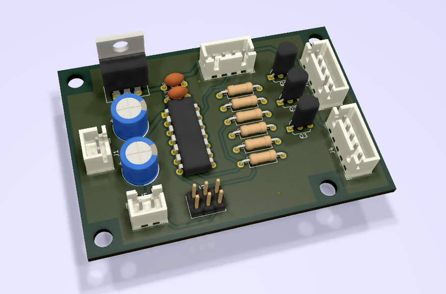
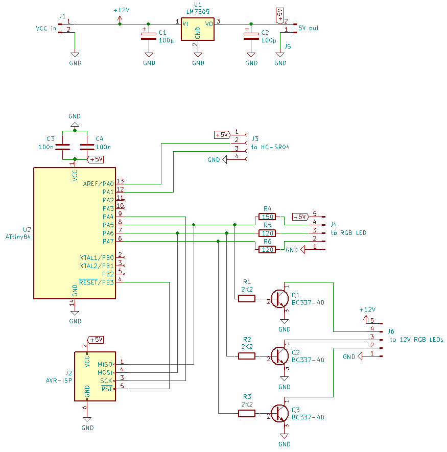

# parkranger
Ultrasonic park distance LED lights for garage or carport.

## Hardware

AVR micro-controller ATmega ATtiny84
 - internal oscillator at 8.0 MHz (disable fuse CLKDIV8!)
 
Ultrasonic sensor module HC-SR04
 - trigger on PA0 (SOIC pin 13)
 - echo on PA1/PCINT1 (SOIC pin 12)

RGB LED
 - 20 mA LEDs or 12V LED module without resistor, both with common anode
 - red on PA5 (SOIC pin 8)
 - green on PA6 (SOIC pin 7)
 - blue on PA7 (SOIC pin 6)

## Software

C code for Atmel Studio 7.0
 - main loop triggers measurements
 - different LED colors/brightness using PWM signals from timer0 and timer1
 - timer0 overflows are counted using interrupt until echo is received to calculate distance
 - echo signal triggers interrupt PCINT1 to start/stop duration counting
 - switches between standby mode (LED almost off, 500ms between measurements, after 60 seconds without distance changes) and parking mode (LED shows distance, 100ms between measurements, after distance changes)

## Electronic CAD files

Design files are made with KiCad. Gerber files for PCB production have also been generated.
 

